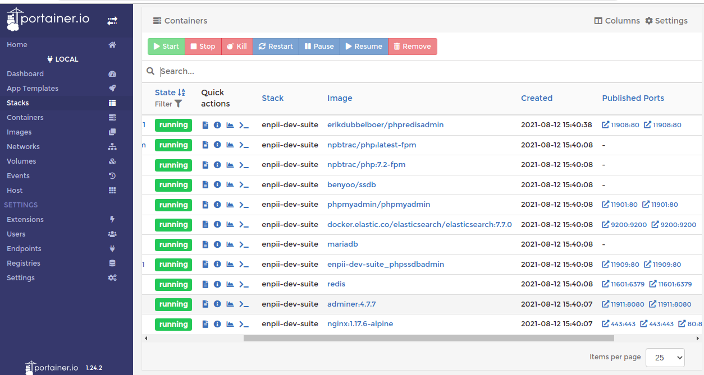
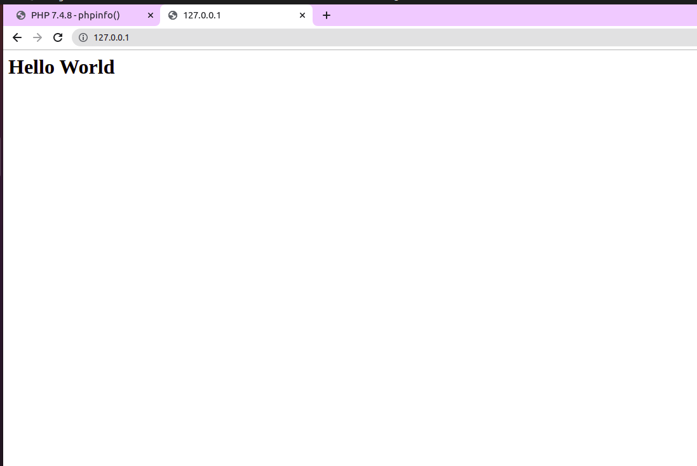
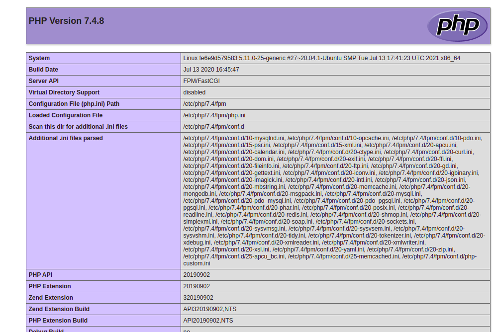
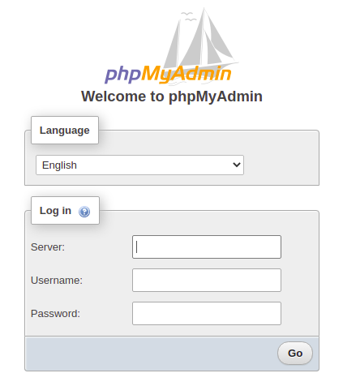

p## How to verify things working correctly
___

First, we install Portainer to see what's port used for Docker container.
```sh
docker run -d -p 3000:3000 -v /var/run/docker.sock:/var/run/docker.sock portainer/portainer
```
And run port 9000 in browser:
<p align="center">
    


___

### Check Nginx is working
Create a new file `default.conf` in etc/nginx and copy data from `default.config.example` to.

But, sure that params `WWW_DIR` in `.env` file has correct path to www folder in local.
Then check and restart nginx with the following commands to take effect what modified:
```sh
    docker exec -it enpii_dev_suite_nginx_main nginx -t 
```
And check in browser it's working:
<div display="flex" align="center">
    
    
</div>

If it isn't working, check State container nginx_main, it can be __"EXIT"__. So see error form file `log/nginx/error.log` . And you can change the configs in `etc/nginx/default.conf`.

___

### Check phpMyAdmin, MySQL Working
Go to port of phpadmin container, you will see
<p align="center">
    
</p>

There have some database server you can choose : mariadb, mysql 5 or 8. And user/password should be root.
If you log in successfully, that everything is working ok.

